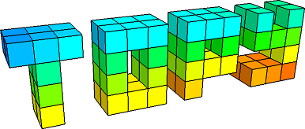
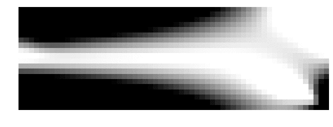
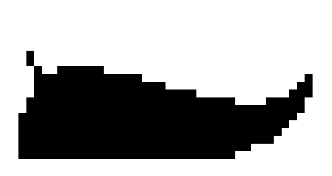
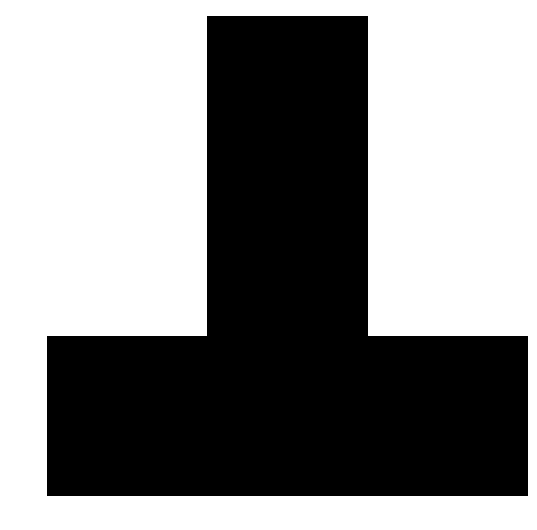

## What is ToPy?
ToPy is short for **t**opology **o**ptimization using **Py**thon. It is a lightweight framework for Python that can solve one of three types of topology optimisation problems: 
1. minimum compliance (same as maximum stiffness),
2. heat conduction or
3. mechanism design (synthesis).

<div align="left">
	
	
	
</div>

A problem is defined (created) by means of a simple text input file, called a TPD file, which stands for ToPy Problem
Definition.

ToPy solves the defined problem to obtain a 2D (or 3D, depending on the input file) checker-free black-white (in 2D) or solid-void (in 3D) solution. The result is
1. an optimally stiff structure for minimum compliance (maximum stiffness) problems,
2. an optimal distribution of two materials for heat conduction problems and
3. an optimal distribution of material for efficient mobility.

The 2D results are PNG (or any format that Matplotlib can save) files and the 3D results are legacy VTK files.

## Installation
Install packages below via `pip` or by other means:
1. NumPy+MKL
2. SciPy
3. matplotlib
4. SymPy
5. PyVTK

You will also need to install [Gmsh](http://gmsh.info).

Once you've downloaded the dependencies, all you need to do is the following:

```bash
$ git clone https://github.com/thebeachlab/topy.git
$ cd topy/topy
$ (sudo) python setup.py install
```
If there aren't any errors, then ToPy is installed. Congratulations!

## Documentation
Please refer to the [ToPy Docs](docs/README.md) for further information.

## Limitations
  * ToPy only works with regular square (for 2D)  and cubic (for 3D) meshes. Your mesh will therefore consist of perfectly square (for 2D) or perfectly cubic (for 3D) elements.
  * No GUI for defining problems
  * No CAD interface (although you can save the 3D files as STL files via ParaView)

