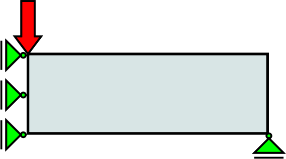
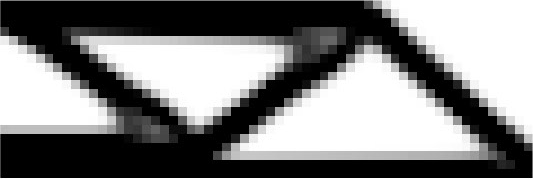
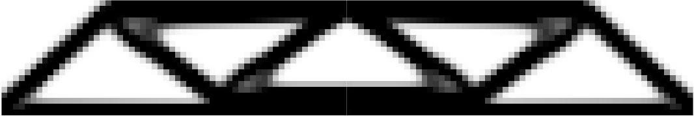
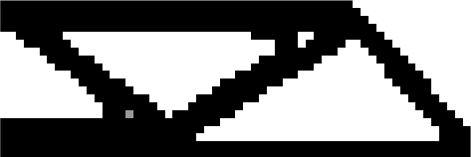

# Examples of ToPy results

## 'Standard' 2D MBB beam
The MBB beam is really just a horizontal simply supported beam with a point load in the middle, exactly between the two supports, acting in the vertical direction. Because the constraints, geometry (region) and loading is symmetric, this problem is often solved by only analysing half the structure, by 'cutting' it vertically at the point load. As far as I can figure out, the layout of material in a region that results in this geometry was originally proposed by Messerschmitt-Bolkow-Blohm (see for example [Free Patents Online](http://www.freepatentsonline.com/4774117.html)).



### TPD file contents
```
[ToPy Problem Definition File v2007]

# Author: William Hunter
# The 'classic' 60x20 2d MBB beam, as per Ole Sigmund's 99 line code.

PROB_TYPE  : comp         # compliance (stiffness) problem
PROB_NAME  : beam_2d_reci # output files will have this name
ETA        : 0.5          # reciprocal approximation
DOF_PN     : 2            # degrees of freedom per node
VOL_FRAC   : 0.5          # volume fraction, so we want only 50% of the area to be used for structure
FILT_RAD   : 1.5          # how 'thick' we want regions
ELEM_K     : Q4           # element type, for 2d almost always a linear 4 node element
NUM_ELEM_X : 60           # number of elements in the x direction, which is equal to your dimension in x
NUM_ELEM_Y : 20           # number of elements in the y direction, which is equal to your dimension in y
NUM_ELEM_Z : 0            # because it's a 2d problem
FXTR_NODE_X: 1|21         # fix translation of these node numbers in x direction
FXTR_NODE_Y: 1281         # fix translation of this node number in y direction
LOAD_NODE_Y: 1            # load this node number in y direction
LOAD_VALU_Y: -1           # the sign and size of the load in the y direction, for this problem it won't make a difference

NUM_ITER   : 94           # number of iterations to run, generally around 50 is enough, depending on the problem

P_FAC      : 3            # penalty factor; sort of how aggressive to get rid of elements (material)
```

### Result (solution)
After 94 iterations, you should end up with a file named _mbb_beam_2d_reci_094.tpd_, that looks like this:



If the image is mirrored, and placed next to itself, you end up with the result below, which is the full MBB beam. I did the below in an image manipulation program, so not perfect, but you get the idea.



---

## 'Standard' 2D MBB beam with GSF

### GSF (grey-scale filtering)
Notice that there's a significant amount of grey material for the above solution, which is undesirable -- we want 'pure' black-white solutions. To get that, we can make use of GSF (grey-scale filtering).

### TPD file contents
```
[ToPy Problem Definition File v2007]

# Author: William Hunter
# The 'classic' 60x20 2d mbb beam, as per Ole Sigmund's 99 line code, but with
# grey-scale filtering.

PROB_TYPE  : comp
PROB_NAME  : beam_2d_reci_gsf
ETA        : 0.5  # reciprocal approx.
DOF_PN     : 2
VOL_FRAC   : 0.5
FILT_RAD   : 1.5
ELEM_K     : Q4
NUM_ELEM_X : 60
NUM_ELEM_Y : 20
NUM_ELEM_Z : 0
FXTR_NODE_X: 1|21
FXTR_NODE_Y: 1281
LOAD_NODE_Y: 1
LOAD_VALU_Y: -1

NUM_ITER   : 100

# Grey-scale filter (GSF)
P_FAC      : 1
P_HOLD     : 25  # num of iters to hold p constant from start
P_INCR     : 0.2  # increment by this amount
P_CON      : 1  # increment every 'P_CON' iters
P_MAX      : 3  # max value of 'P_CON'

Q_FAC      : 1
Q_HOLD     : 25  # num of iters to hold q constant from start
Q_INCR     : 0.05  # increment by this amount
Q_CON      : 1  # increment every 'Q_CON' iters
Q_MAX      : 5  # max value of 'Q_CON'
```

### Result (solution)
After 94 iterations, you should end up with a file named _mbb_beam_2d_reci_gsf_094.tpd_, that looks like this:



# I want to know more!
Here is a short [Tutorial](Tutorials.md) on creating 2D problems.