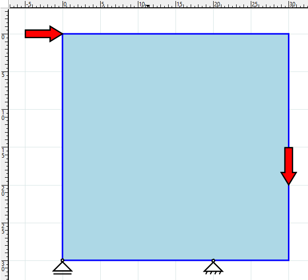
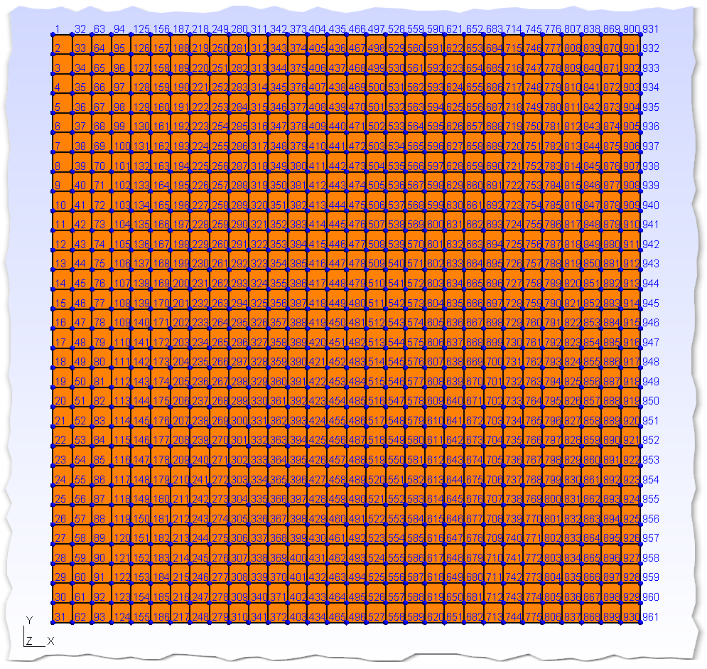
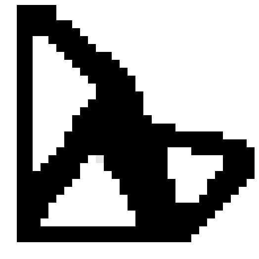
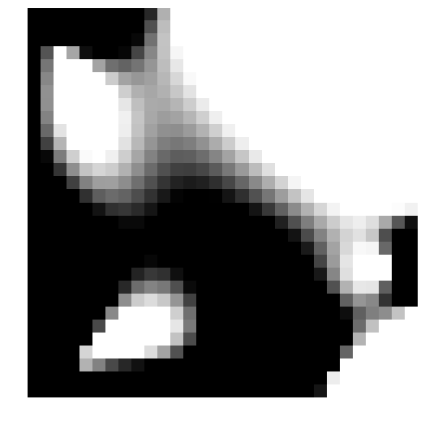
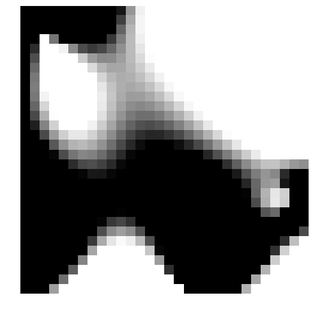
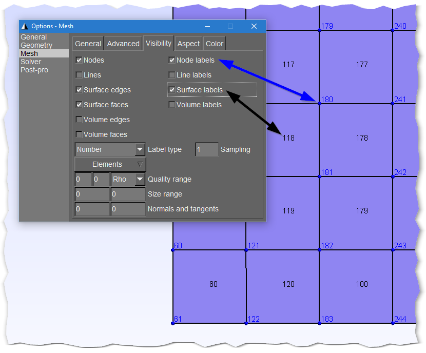
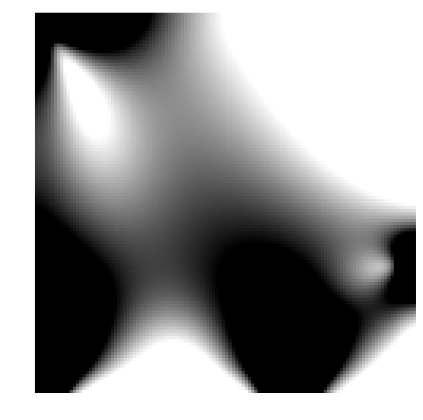

# Tutorials

Please read through the list of ToPy Keywords on the
[Help](Help.md) page,
else the below is not going to make a lot of sense.

The Tutorials build on each other, if you jump straight to, for example Tutorial 3, you will miss some steps on how to solve a problem.

# Typical workflow
1. Conceptualize the problem (this can be done on a piece of paper)
   * Define the dimensions of an area (2d) or volume (3d) that represents your design domain
   * Define the boundary conditions of the domain
   * Define the loads acting on the domain
   * Optional: define which elements you want to remove or keep (for example, if you want a void and/or a solid region somewhere in your domain)
2. Discretise (mesh) the domain using ToPy's built in Gmsh MSH creation functions
3. Determine the locations of your boundary conditions and loads on the mesh
   * Use Gmsh to view the mesh, so that you can see the node and element numbers since you'll need these for the next step
4. Create a TPD file, or alternatively a TPD config dictionary
5. Solve the problem and view the results 

# Tutorial 1

## Problem
Two loads acting on a 30x30 square area, supported at two locations at the bottom. What is the stiffest structure I can place inside the area to resist the two loads?



Note that the bottom left constraint can 'slide' in the horizontal direction (along the X-axis).

### Trivial solution
The stiffest possible structure we can place in our 30x30 domain (region/area) is simply to put material everywhere in the domain, but that's **exactly what we don't want to do**.

## ToPy solution (limited material usage)
Assume we don't have material to fill the 30x30 area, let's say we only have 20x20 (400) elements that we need to place in the 900 possible locations in our grid, but where to place them to obtain an optimally stiff structure? A brute force approach is to check each possible **valid** (forming realistic load paths) layout for the domain until the stiffest structure is found, which works out to roughly 0.5(900!/(900-400)!) permutations (I think, but you can probably see that it's going to be a big number). The alternative is to make use of topology optimisation.

## Approach
We start with a 30x30 grid, with loading (forces at nodes) and constraints (fixtures at nodes) as shown in the figure above (the red arrows are the loads) applied at the relevant node numbers. Note that the node numbering is from top left corner downwards -- **all** 2d ToPy problems must follow this numbering scheme. The mesh was created using ToPy's `create_2d_msh` function, the mesh is viewed in [Gmsh](http://gmsh.info).



Create the `msh' file by entering the following in a Python or IPython console:

    >> create_2d_msh(30, 30, 'tut1')

This will create a file named 'tut1.msh' that can be opened and viewed with Gmsh. Looking at the mesh, we can see that the loads are applied at node numbers 1 and 951.

### Define the TPD file
Open a text editor, for example Notepad on Windows, and enter the following lines of text (shown in blocks below).

The first line of a TPD file **must** be
 
    [ToPy Problem Definition File v2007]

or else ToPy will complain and not run. Save the file as _tut1_2d.tpd_ (it can be any name, but you don't use spaces in the name). The rest of the keywords can have any order, whitespace has no effect. Next, we give the problem a name, it doesn't have to be the same as the file name (but again, no spaces, use an underscore instead):

    PROB_NAME: tut1_2d

and we say what type of problem it is. In this case, it is a minimum **comp**liance problem:

    PROB_TYPE: comp # you can add comments after a hash

You need to say how many elements you have in the X and Y direction:

    NUM_ELEM_X: 30
    NUM_ELEM_Y: 30
    NUM_ELEM_Z: 0 # set to zero for 2d problems

Set the fraction of the area you want to use:

    VOL_FRAC: 0.444 # 20*20/30*30

Specify which nodes are loaded, and their magnitudes and directions. Normally you'd normalise the loads.

    LOAD_NODE_X: 1 # load node number 1 ... 
    LOAD_VALU_X: 1 # in the positive X-direction
    LOAD_NODE_Y: 951 # load node number 951... 
    LOAD_VALU_Y: -1 # in the negative Y-direction

Specify which nodes are fixed, and the translation direction(s) in which they're constrained.

    FXTR_NODE_X: 651 # this is the only node that is fixed in the X-direction
    FXTR_NODE_Y: 31; 651 # these nodes are fixed in the Y-direction

Specify the finite element type to be used, as well as the number of degrees of freedom per node:

    ELEM_K: Q4 # element type (stiffness matrix) for 2d compliance problems
    DOF_PN: 2 # degrees of freedom per node, 2 for 2d compliance problems

Finally, the optimisation parameters:

    # Optimisation parameters:
    # If you just want a quick answer, use the below values
    ETA: 0.5 # 0.4 for 3d
    FILT_RAD: 1.5 # 1.8 for 3d
    P_FAC: 3 # up to 3.5
    Q_FAC: 2.5 # extra penalty factor (grey-scale filter)
    NUM_ITER: 30 # stop after 30 iterations

Here's the complete TPD file (you can copy-and-paste into an empty text file):

	[ToPy Problem Definition File v2007]

	PROB_NAME: tut1_2d

	PROB_TYPE: comp # you can add comments after a hash

	NUM_ELEM_X: 30
	NUM_ELEM_Y: 30
	NUM_ELEM_Z: 0 # set to zero for 2d problems

	VOL_FRAC: 0.444 # 20*20/30*30

	LOAD_NODE_X: 1 # load node number 1 ... 
	LOAD_VALU_X: 1 # in the positive X-direction
	LOAD_NODE_Y: 951 # load node number 951... 
	LOAD_VALU_Y: -1 # in the negative Y-direction

	FXTR_NODE_X: 651 # this is the only node that is fixed in the X-direction
	FXTR_NODE_Y: 31; 651 # these nodes are fixed in the Y-direction

	ELEM_K: Q4 # element type (stiffness matrix) for 2d compliance problems
	DOF_PN: 2 # degrees of freedom per node, 2 for 2d compliance problems

	# Optimisation parameters:
	# If you just want a quick answer, use the below values
	ETA: 0.5 # 0.4 for 3d
	FILT_RAD: 1.5 # 1.8 for 3d
	P_FAC: 3 # up to 3.5
	Q_FAC: 2.5 # extra penalty factor (grey-scale filter)
	NUM_ITER: 30 # stop after 30 iterations

## Solving
Once you have the TPD file, copy `optimise.py` (from the ToPy scripts directory) to the same location as the TPD file, and then type the following in a terminal (make sure you're in the correct directory in your terminal).

    $ python optimise.py tut1_2d.tpd

### Terminal output
You should see the following output in your terminal, and a bunch (30 to be exact) of PNGs in the same directory. Notice how the objective function (the thing that you're optimising for) becomes smaller, until about 29 iterations when it doesn't change much any more (CHANGE value is 1.6454e-09 at 29 iterations). At this point you can probably stop, you'll also see that the solid-void fraction (S-V frac.) is almost 1 (0.999). That's why we only specified
30 iterations (this can be automated, see Tutorial 2 below).

    ===============================================================================
    ToPy problem definition (TPD) file successfully parsed.
    TPD file name: tut1_2d.tpd (v2007)
    -------------------------------------------------------------------------------
    Domain discretisation (NUM_ELEM_X x NUM_ELEM_Y) = 30 x 30
    Element type (ELEM_K) = Q4
    Filter radius (FILT_RAD) = 1.5
    Number of iterations (NUM_ITER) = 30
    Problem type (PROB_TYPE) = comp
    Problem name (PROB_NAME) = tut1_2d
    Continuation of penalisation factor (P_FAC) not specified
    GSF active
    Damping factor (ETA) = 0.50
    No passive elements (PASV_ELEM) specified
    No active elements (ACTV_ELEM) specified
    ===============================================================================
     Iter | Obj. func.   | Vol.  | Change     | P_FAC | Q_FAC | Ave ETA | S-V frac.
    -------------------------------------------------------------------------------
       1  | 8.358387e+02 | 0.444 | 2.0000e-01 | 3.000 | 2.500 |  0.500  |  0.000
       2  | 3.697232e+02 | 0.444 | 2.0000e-01 | 3.000 | 2.500 |  0.500  |  0.000
       3  | 1.879175e+02 | 0.444 | 2.0000e-01 | 3.000 | 2.500 |  0.500  |  0.454
       4  | 1.241993e+02 | 0.444 | 2.0000e-01 | 3.000 | 2.500 |  0.500  |  0.620
       5  | 1.067986e+02 | 0.444 | 2.0000e-01 | 3.000 | 2.500 |  0.500  |  0.780
       6  | 1.006967e+02 | 0.444 | 2.0000e-01 | 3.000 | 2.500 |  0.500  |  0.853
       7  | 9.836660e+01 | 0.444 | 2.0000e-01 | 3.000 | 2.500 |  0.500  |  0.900
       8  | 9.711562e+01 | 0.444 | 2.0000e-01 | 3.000 | 2.500 |  0.500  |  0.933
       9  | 9.653572e+01 | 0.444 | 2.0000e-01 | 3.000 | 2.500 |  0.500  |  0.959
      10  | 9.628151e+01 | 0.444 | 2.0000e-01 | 3.000 | 2.500 |  0.500  |  0.968
      11  | 9.612210e+01 | 0.444 | 2.0000e-01 | 3.000 | 2.500 |  0.500  |  0.974
      12  | 9.596980e+01 | 0.444 | 2.0000e-01 | 3.000 | 2.500 |  0.500  |  0.980
      13  | 9.584600e+01 | 0.444 | 2.0000e-01 | 3.000 | 2.500 |  0.500  |  0.981
      14  | 9.577452e+01 | 0.444 | 2.0000e-01 | 3.000 | 2.500 |  0.500  |  0.981
      15  | 9.573832e+01 | 0.444 | 6.1204e-02 | 3.000 | 2.500 |  0.500  |  0.989
      16  | 9.572545e+01 | 0.444 | 9.3079e-02 | 3.000 | 2.500 |  0.500  |  0.989
      17  | 9.572103e+01 | 0.444 | 1.4164e-01 | 3.000 | 2.500 |  0.500  |  0.990
      18  | 9.572643e+01 | 0.444 | 2.0000e-01 | 3.000 | 2.500 |  0.500  |  0.992
      19  | 9.574836e+01 | 0.444 | 2.0000e-01 | 3.000 | 2.500 |  0.500  |  0.991
      20  | 9.578061e+01 | 0.444 | 5.0250e-02 | 3.000 | 2.500 |  0.500  |  0.994
      21  | 9.579138e+01 | 0.444 | 5.3160e-02 | 3.000 | 2.500 |  0.500  |  0.997
      22  | 9.579561e+01 | 0.444 | 5.9350e-02 | 3.000 | 2.500 |  0.500  |  0.997
      23  | 9.580103e+01 | 0.444 | 7.5427e-02 | 3.000 | 2.500 |  0.500  |  0.997
      24  | 9.580654e+01 | 0.444 | 7.7182e-02 | 3.000 | 2.500 |  0.500  |  0.998
      25  | 9.580686e+01 | 0.444 | 8.9910e-02 | 3.000 | 2.500 |  0.500  |  0.998
      26  | 9.580255e+01 | 0.444 | 9.1640e-02 | 3.000 | 2.500 |  0.500  |  0.998
      27  | 9.579435e+01 | 0.444 | 5.3421e-02 | 3.000 | 2.500 |  0.500  |  0.999
      28  | 9.578835e+01 | 0.444 | 8.7270e-10 | 3.000 | 2.500 |  0.500  |  0.999
      29  | 9.578835e+01 | 0.444 | 1.6454e-09 | 3.000 | 2.500 |  0.500  |  0.999
      30  | 9.578835e+01 | 0.444 | 6.6716e-10 | 3.000 | 2.500 |  0.500  |  0.999

    Solid plus void to total elements fraction = 0.99889
    30 iterations took 0.112 minutes (0.004 min/iter. or 0.224 sec/iter.)
    Average of all ETA's = 0.500 (average of all a's = 1.000)

## Result
You should end up with this:



How the domain changes (GIF animation created with ImageMagick: `convert -delay 30 *.png tut1_2d.gif`):



# Tutorial 2
Solve the same problem as above, but change the following 2 lines (parameters):

    PROB_NAME: tut2_2d
    FXTR_NODE_X: 31; 651 # these nodes are fixed in the X-direction

Both constraints at the bottom are now fixed in the X-direction, so we expect the bottom horizontal brace to disappear...

Delete

    NUM_ITER: 30 # stop after 30 iterations

and replace with

    CHG_STOP: 0.001 # stop when objective function changes less than this

## Result



# Tutorial 3
Solve the same problem as for Tutorial 2 above, but use a finer mesh and a more complicated grey-sclae filter (GSF). Create a 120x120 mesh (4 times finer), create a Gmsh file by issueing the following commands in Python (or IPython):

    import topy
    topy.create_2d_msh(120, 120, 'tut3_2d')

This will create a msh file that you can view with Gmsh, which is handy for finding element numbers and node numbers. To view the element and node numbers, use the following Gmsh settings:


    

Finally, create the below TPD file and solve:

```
[ToPy Problem Definition File v2007]

PROB_NAME: tut3_2d

PROB_TYPE: comp # you can add comments after a hash

NUM_ELEM_X: 120
NUM_ELEM_Y: 120
NUM_ELEM_Z: 0 # set to zero for 2d problems

VOL_FRAC: 0.444 # 4/9

LOAD_NODE_X: 1 # load node number 1 ...
LOAD_VALU_X: 1 # in the positive X-direction
LOAD_NODE_Y: 14601 # load node number 14601...
LOAD_VALU_Y: -1 # in the negative Y-direction

FXTR_NODE_X: 121; 9801 # these nodes are fixed in the X-direction
FXTR_NODE_Y: 121; 9801 # these nodes are fixed in the Y-direction

ELEM_K: Q4 # element type (stiffness matrix) for 2d compliance problems
DOF_PN: 2 # degrees of freedom per node, 2 for 2d compliance problems

# Optimisation parameters:
# If you just want a quick answer, use the below values
ETA: 0.5 # 0.4 for 3d
FILT_RAD: 6 # 1.8 for 3d
CHG_STOP: 0.001 # stop when objective function changes less than this

# Grey-scale filter (GSF)
P_FAC      : 1
P_HOLD     : 5  # num of iters to hold p constant from start
P_INCR     : 0.25  # increment by this amount
P_CON      : 1  # increment every 'P_CON' iters
P_MAX      : 3  # max value of 'P_CON'

Q_FAC      : 1
Q_HOLD     : 10  # num of iters to hold q constant from start
Q_INCR     : 0.5  # increment by this amount
Q_CON      : 5  # increment every 'Q_CON' iters
Q_MAX      : 5  # max value of 'Q_CON'
```

## Result


